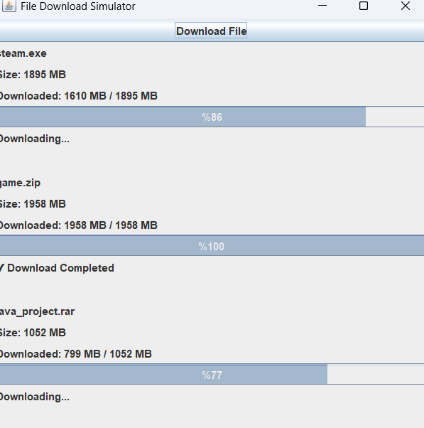

# 📥 File Download Simulator

Java Swing kullanılarak geliştirilen, birden fazla dosyanın aynı anda indiriliyormuş gibi simüle edildiği bir masaüstü uygulamasıdır.

Bu proje; `Thread`, `Swing Timer`, `JProgressBar` ve Swing bileşenleri kullanılarak çoklu indirme işlemlerinin nasıl yönetilebileceğini öğrenmek ve uygulamak amacıyla geliştirilmiştir.

## ✨ Özellikler

- Birden fazla dosyanın aynı anda indirilmesinin simüle edilmesi
- Her indirme işlemi için ayrı ilerleme çubuğu
- Her dosyanın bağımsız indirme sürecine sahip olması
- İndirme durumunun anlık olarak gösterilmesi
- Dinamik olarak indirme panellerinin oluşturulması
- Dosya boyutlarının rastgele belirlenmesi
- İndirilen miktarın MB cinsinden gösterilmesi
- İndirme tamamlandığında durum bilgisinin güncellenmesi
- Basit ve kullanışlı Swing arayüzü

## 🛠️ Kullanılan Teknolojiler

- Java
- Java Swing
- Thread
- Swing Timer
- JProgressBar
- JPanel
- JFrame

## 🎯 Projenin Amacı

Bu projenin temel amacı, Java Swing kullanarak çoklu görev ve animasyon benzeri süreçlerin nasıl yönetilebileceğini öğrenmektir.

Özellikle aşağıdaki konularda pratik yapılmıştır:

- Thread kullanımı
- Birden fazla işlemin bağımsız şekilde çalıştırılması
- Swing bileşenlerinin dinamik olarak oluşturulması
- Progress bar kullanımı
- GUI üzerinde anlık durum güncellemeleri
- Nesne tabanlı programlama yaklaşımı

## ⚙️ Çalışma Mantığı

Uygulama başlatıldığında kullanıcıya indirilebilecek dosyalar sunulur.

Bir dosya seçildiğinde o dosya için yeni bir indirme paneli oluşturulur. Her indirme işlemi kendi sürecine sahip olacak şekilde çalışır ve ilerleme durumu ilgili `JProgressBar` üzerinden gösterilir.

Birden fazla dosya seçildiğinde indirmeler birbirinden bağımsız olarak ilerleyebilir.

## 📸 Screenshot



## 🚀 Çalıştırma

Projeyi bilgisayarınıza klonlayın:

```bash
git clone https://github.com/Musab2300/File-Download-Simulator.git
